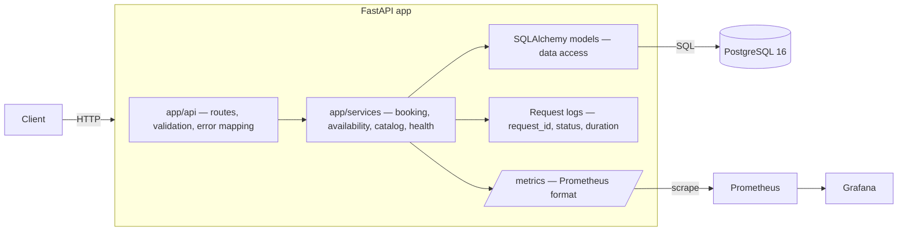
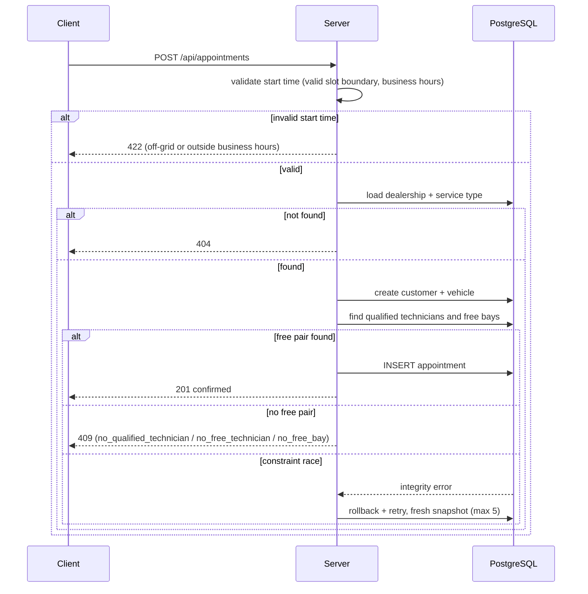

# Appointment Scheduler — System Design

## 1. Core Requirements

1. **Resource-constrained booking** — allow a user to request a service
   appointment for a specific vehicle, service type, and dealership at a
   desired time.
2. **Real-time availability check** — before confirming, check that both a
   service bay and a qualified technician are available for the entire service
   duration.
3. **Confirmed appointment record** — upon success, create a persistent
   appointment record associating the customer, vehicle, technician, and
   service bay.

**Coverage**

| Requirement | Implementation |
|---|---|
| 1 | `POST /api/appointments` + `app/services/booking.py` |
| 2 | Overlap checks in `app/services/availability.py` |
| 3 | Persistent `appointments` row + `GET /api/appointments/{id}` |

## 2. Assumptions (agreed ambiguities)

| # | Decision |
|---|----------|
| A1 | No auth; a new customer record is created per booking, no existing customer to lookup. |
| A2 | Free-form vehicle fields (make/model/year/VIN); no existing vehicle catalog to lookup. |
| A3 | Fixed 60-minute booking grid; duration fixed per service type. |
| A4 | Identical business hours for every dealership |
| A5 | Booking atomically re-checks availability. |
| A6 | User can create and view an appoinment; no reschedule or cancel. |
| A7 | Bays/technicians belong to one dealership; no sharing across dealerships. |

## 3. Architecture

**Component roles**

- **Client** — external HTTP consumer (browser, Swagger UI, or API client)
  driving the booking flow.
- **API routes (`app/api/`)** — validation (Pydantic), routing, error mapping
  (404/409/422); thin layer, no business logic.
- **Services (`app/services/`)** — qualification/overlap checks and the atomic
  booking transaction with bounded retry.
- **Data access (`app/models.py`, `app/database.py`)** — ORM models and async
  engine/session management; the typed boundary between services and the store.
- **PostgreSQL** — the database and source of truth; exclusion constraints make
  overlapping bookings impossible at the DB level.
- **Prometheus** — scrapes `GET /metrics` and stores request-rate, latency, and
  booking-conflict metrics.
- **Grafana** — provisioned dashboard (request rate, p95 latency, booking
  conflicts) reading from Prometheus.

## 4. Data flow

## 5. Data model

| Model | Role |
|-------|------|
| `dealerships` | Venue + IANA timezone; owns bays and technicians. |
| `service_types` | Fixed duration; drives `end_time` and slot grid. |
| `technicians` | Human resource, dealership-scoped. |
| `technician_qualifications` | M2M tech ↔ service type; defines "qualified". |
| `service_bays` | Physical bay, dealership-scoped. |
| `customers` | Contact info recorded per booking (no dedup). |
| `vehicles` | Free-form car details recorded per appointment. |
| `appointments` | Booking record: customer, vehicle, tech, bay, service type, UTC start/end, status. |

**No-double-booking guarantee**: `EXCLUDE USING gist` on:  
- `(service_bay_id, tstzrange(start_time, end_time))`.
- `(technician_id, tstzrange(start_time, end_time))`.

`tstzrange` uses `[)` bounds, so back-to-back appointments are allowed. The service layer adds a
bounded retry so concurrent requests spread across free pairs instead of
failing on the first race.

## 6. API summary

| Method / Path | Purpose |
|---------------|---------|
| GET `/health` | Liveness + DB ping |
| GET `/api/dealerships`, `/api/service-types` | Read-only reference data |
| POST `/api/appointments` | Create booking (customer + vehicle + appointment atomically) |
| GET `/api/appointments` | List appointments (filter by dealership / start_from / start_to) |
| GET `/api/appointments/{id}` | Retrieve one appointment |

Timestamps normalize to UTC for storage; responses return UTC.

## 7. Technologies

**Python 3.14 + FastAPI.** I chose FastAPI for three reasons: it's async
without ceremony, Pydantic gives me validated request/response models at the
API boundary, and it has built-in Swagger.

**PostgreSQL 16.** I chose PostgreSQL because it's the most popular
open-source relational database. It also fits this problem well:
booking is fundamentally an ACID problem, so the availability check and the
insert have to be atomic - otherwise two concurrent requests could both
confirm the same resource - and PostgreSQL's native exclusion constraints are
what the data model uses to prevent overlapping bookings.

**Prometheus + Grafana.** I chose Prometheus for metrics collection and
Grafana for dashboards.

The stack is open source and self-hostable, with no vendor lock-in.

## 8. Observability

**Implemented**:

- `/health`: confirms the app is up and the database is reachable.
- Request logs: one line per request (request ID, endpoint, status,
  duration); no customer data.
- `/metrics`: Prometheus-format: request count, latency, and booking-conflict
  count.
- Grafana: provisioned dashboard (request rate, p95 latency, booking
  conflicts), fed by Prometheus scraping `/metrics`.
